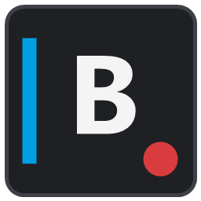

<p align="center">
  
</p>

# Blackbox

Blackbox is a Windows desktop recorder for continuously capturing games and other application windows through a private OBS Studio backend. It records interruption-resistant MKV segments, presents them as one continuous session, and provides the tools needed to review, mark, protect, mix, and export the footage without managing OBS by hand.

Blackbox is built with .NET 8, WPF, SQLite, OBS Studio, FFmpeg, and LibVLC. The current build supports Windows 10 version 2004 (build 19041) or later on 64-bit systems.

> Blackbox is currently a pre-release desktop application. The capture, recovery, review, export, microphone, and automatic game-selection workflows are implemented and tested, but release distribution and the planned OBS dock are still being prepared.

## Contents

- [Why Blackbox](#why-blackbox)
- [Highlights](#highlights)
- [Requirements](#requirements)
- [Getting Started](#getting-started)
- [Using Blackbox](#using-blackbox)
- [Recording Format](#recording-format)
- [Files And Local Data](#files-and-local-data)
- [Build From Source](#build-from-source)
- [Architecture](#architecture)
- [Privacy And Safety](#privacy-and-safety)
- [Troubleshooting](#troubleshooting)
- [Testing And Project Status](#testing-and-project-status)
- [Documentation](#documentation)
- [Roadmap](#roadmap)
- [Contributing](#contributing)
- [License And Third-Party Software](#license-and-third-party-software)

## Why Blackbox

Traditional recordings are easy to lose when a game, encoder, or computer stops unexpectedly. Blackbox takes a different approach:

1. OBS writes short, independently recoverable MKV segments.
2. Blackbox indexes completed segments into a local SQLite library.
3. The recordings library presents adjacent compatible segments as one timeline.
4. Important moments can be marked or protected from automatic cleanup.
5. A full session or selected range can be exported as one continuous MKV or MP4.

The original segments remain the durable source of truth. Continuous playback and export are built over them instead of replacing them with one fragile, ever-growing recording file.

## Highlights

### Automatic Capture

- Enumerates visible taskbar application windows and lets the user decide which ones to remember.
- Ignores applications that have not been explicitly remembered.
- Starts and stops recording when enabled remembered applications open or close.
- Uses two-sample launch confirmation and a stop grace period to avoid capture churn.
- Detects live client-size changes and reframes OBS without restarting the recording.
- Learns launcher-to-game executable handoffs as visible, removable aliases.
- Uses optional Windows GPU activity only as a ranking signal, never as a hard dependency.
- Recovers protected Steam executable paths from Steam's active process records when normal inspection is blocked.
- Lets the user switch between multiple open remembered games while recording or idle.
- Persists the preferred game and ranks it above foreground and GPU heuristics until it closes.

### Private OBS Automation

- Detects standard OBS and Steam OBS installations, including secondary Steam libraries.
- Creates a private portable OBS runtime under the current user's application data.
- Downloads the official OBS package only when a usable local installation is unavailable.
- Uses a private authenticated localhost obs-websocket connection on a dynamically selected port.
- Creates and repairs the Blackbox profile, scene collection, scene, sources, filters, tracks, and MKV splitting settings.
- Configures Game Capture as `Capture specific window` with `Window title must match` and the exact live OBS window identifier.
- Keeps Blackbox's scene and profile separate from the user's personal or Steam OBS configuration.

### Audio And Microphones

- Records five named audio tracks for the full mix, game, voice chat, raw microphone, and processed microphone.
- Follows the current Windows default microphone automatically during setup and recording start.
- Supports microphone exclusions and a manual device-selection fallback.
- Preserves raw and processed microphone paths as separate tracks.
- Calibrates input gain, expander, compressor, and limiter settings from room noise, normal voice, and loud voice samples.
- Monitors the selected device while recording and restores routing after a disconnect or default-device change.

### Review And Export

- Groups adjacent physical segments into continuous recording sessions.
- Provides an embedded LibVLC player with play, pause, mute, volume, speed, looping, fullscreen, audio-track selection, 10-second jumps, segment jumps, and frame stepping.
- Draws numbered segment boundaries, cached thumbnails, and a full-mix waveform on the timeline.
- Supports quick tags, manual event markers, marker navigation, and marker removal.
- Protects selected ranges and the previous five minutes from storage cleanup.
- Exports a whole session or selected range to one MKV or MP4.
- Supports per-track mute, solo, volume, and optional separate 24-bit PCM WAV exports.
- Locks source segments while playback or export is using them.

### Recovery And Diagnostics

- Scans stable MKV and MP4 files at startup and reconciles them with SQLite metadata.
- Attempts a lossless FFmpeg remux when a stable file cannot be read.
- Verifies repaired media before replacement and keeps the original in a recovery-backups folder.
- Adopts a surviving OBS recording after a Blackbox restart without issuing a duplicate start request.
- Shows recording, automatic-capture, storage, recovery, and media-health state in Diagnostics.
- Creates a privacy-reviewed support bundle with capped and redacted event data.
- Keeps settings writes atomic and uses SQLite WAL mode for safe concurrent access.

### Desktop Experience

- OBS-inspired dark WPF interface with Capture, Recordings, Games, Microphone, Diagnostics, Settings, and Help workspaces.
- Notification-area controls for recording, protection, automatic capture, recordings, and application exit.
- Optional close-to-notification-area and minimize-to-notification-area behavior.
- Optional current-user Windows startup with a quiet `--background` launch.
- Optional automatic OBS setup and remembered-game watching at startup.
- Recording choices for 720p, 1080p, 1440p, 4K, or match-application resolution; 30, 60, or 120 FPS; and 160, 256, or 320 kbps audio.
- First-run tutorial, permanent Help workspace, control reference, and focused tooltips.

## Requirements

### Packaged Windows Build

- Windows 10 version 2004, build 19041, or later.
- 64-bit Windows.
- Enough free space for recordings. The default policy reserves at least 10 GB and limits managed footage to 50 GB or 24 hours.
- Internet access on first use when OBS or FFmpeg must be downloaded.

The self-contained Windows package includes the required .NET runtime. An existing OBS installation is helpful but not required: Blackbox first checks standard and Steam installations, then downloads the official package when necessary.

### Source Build

- Windows 10 or later.
- [.NET 8 SDK](https://dotnet.microsoft.com/download/dotnet/8.0).
- Git.
- Internet access for NuGet restore and first-time OBS or FFmpeg provisioning.

## Getting Started

### Packaged Build

1. Download the Windows x64 archive from the project's Releases page once releases are available.
2. Extract the entire archive to a normal writable folder. Do not run the executable from inside the ZIP.
3. Run `Blackbox.App.exe`.
4. Wait for `OBS is configured and ready.` Blackbox may copy an existing OBS installation or download a private runtime during the first launch.
5. Open **Microphone** and confirm automatic default-microphone routing, exclusions, or a manual fallback.
6. Use **Check OBS** for a short setup validation when you want Blackbox to verify a real recording output.
7. Make a short manual recording and open **Recordings** to confirm playback and audio tracks.

Blackbox stores its private runtime and settings under `%LOCALAPPDATA%\Blackbox`. Administrator access is not required.

### Remember A Game Or Application

1. Start the program and leave its main taskbar window open.
2. In Blackbox, open **Games** and select **Manage remembered games**.
3. Select the program under **Open application windows**.
4. Select **Remember as game**.
5. Leave **Record automatically** enabled for that profile if it should participate in automatic capture.
6. Enable automatic capture from the Capture workspace or enable **Automatic recording at startup** in Settings.

Blackbox does not guess which processes are games. Any visible taskbar application can be remembered, and only remembered profiles are eligible for automatic recording.

### Switch Between Open Games

When more than one remembered game is open:

1. Open the game manager.
2. Select the running remembered application that should be captured.
3. Select **Use for capture**.

The selected row reports `Active OBS capture`. If a recording is already running, Blackbox updates the game-video and isolated game-audio bindings in place without changing active recording output settings. If recording is stopped, OBS is prepared for the selected window. The preference survives a Blackbox restart and falls back automatically when that game closes.

## Using Blackbox

### Manual Recording

- Select **Start Recording** to begin a manual session.
- Select **Stop** to finish it.
- Select **Protect 5 min** or press `Ctrl+Shift+F7` to protect the most recent five minutes from quota deletion.
- Use **Open Folder** for direct filesystem access or **Recordings** for timeline review.

Manual recordings are written below:

```text
%USERPROFILE%\Videos\Blackbox\Manual\YYYY-MM-DD\
```

### Automatic Recording

- Enable automatic capture after at least one application has been remembered.
- Blackbox confirms a stable window, binds OBS video and audio, then starts recording.
- Closing the selected application starts a grace period before recording stops.
- Automatic recordings are grouped by remembered application and local recording date.

```text
%USERPROFILE%\Videos\Blackbox\Application Name\YYYY-MM-DD\
```

Automatic capture tracks whether it owns a recording. It will not stop a recording that was started manually.

### Review A Session

1. Open **Recordings**.
2. Select a session to load its continuous timeline.
3. Scrub or open the full player from the current cursor position.
4. Use quick tags or add a manual event marker at the playhead.
5. Select a timeline range when only part of the session matters.
6. Protect the range or export it.

Frame navigation is serialized and cancelable so repeated clicks settle on the final requested frame without creating multiple full-resolution decoders.

### Export Continuous Video

Blackbox can export all compatible segments in a session or an exact selected range:

- MKV for resilient, track-friendly output.
- MP4 for broader player and editor compatibility.
- Optional isolated WAV files for selected audio tracks.
- Per-track mute, solo, and volume controls.

Exports are written to a unique partial path and published only after FFmpeg finishes successfully with a non-empty result.

## Recording Format

Blackbox records short MKV segments, two minutes by default, at 48 kHz with five audio tracks:

| Track | Name | Purpose |
| --- | --- | --- |
| 1 | Full listening mix | Convenient playback mix |
| 2 | Game audio | Isolated selected game or application audio |
| 3 | Voice chat | Isolated configured voice-chat application audio |
| 4 | Raw microphone | Unprocessed microphone safety track |
| 5 | Processed microphone | Calibrated microphone track for normal use |

The default recording quality is 1080p, 60 FPS, and 256 kbps audio. These values can be changed in Settings and reapplied to OBS without editing OBS manually.

The default storage policy is:

| Setting | Default |
| --- | ---: |
| Managed recording storage | 50 GB |
| Maximum retained duration | 24 hours |
| Minimum remaining free disk space | 10 GB |
| Segment duration | 2 minutes |

Protected segments and ranges are skipped by automatic quota cleanup.

## Files And Local Data

Blackbox keeps recordings separate from application state:

| Location | Contents |
| --- | --- |
| `%USERPROFILE%\Videos\Blackbox` | Recordings, exports, and recovery backups |
| `%LOCALAPPDATA%\Blackbox\blackbox.db` | Segment, profile, marker, and protected-range metadata |
| `%LOCALAPPDATA%\Blackbox\obs-portable` | Private OBS runtime and portable OBS data |
| `%LOCALAPPDATA%\Blackbox\ffmpeg` | Verified FFmpeg, FFprobe, and FFplay tools |
| `%LOCALAPPDATA%\Blackbox\timeline-cache` | Generated thumbnails and waveform data |
| `%LOCALAPPDATA%\Blackbox\logs` | Rolling diagnostic logs |
| `%LOCALAPPDATA%\Blackbox\*.json` | Connection, microphone, capture, and desktop preferences |

Removing the application folder does not remove recordings or local application data. Back up both the Videos and Local AppData locations when migrating Blackbox to another computer.

## Build From Source

Clone the repository and run the following commands from its root:

```powershell
dotnet restore Blackbox.sln
dotnet build Blackbox.sln -c Release --no-restore
dotnet test Blackbox.sln -c Release --no-build
```

Run the desktop application:

```powershell
dotnet run --project src\Blackbox.App\Blackbox.App.csproj -c Release
```

Create a self-contained Windows x64 package:

```powershell
dotnet publish src\Blackbox.App\Blackbox.App.csproj `
  -c Release `
  -r win-x64 `
  --self-contained true `
  -o artifacts\Blackbox-win-x64
```

The repository treats warnings as errors and enables nullable reference types across projects.

## Architecture

Blackbox keeps capture infrastructure behind interfaces and concentrates lifecycle policy in the recording layer.

| Project | Responsibility |
| --- | --- |
| `Blackbox.App` | WPF UI, dependency injection, tray icon, hotkeys, startup recovery, diagnostics, and LibVLC player |
| `Blackbox.Domain` | Immutable models, validation, settings, and repository contracts |
| `Blackbox.Infrastructure` | OBS websocket control, portable OBS provisioning, Windows process/device discovery, settings, logging, and support bundles |
| `Blackbox.Recording` | Recording lifecycle, automatic capture, microphone monitoring/calibration, protection, and OBS setup orchestration |
| `Blackbox.Storage` | SQLite repositories, schema migration, reconciliation, and quota enforcement |
| `Blackbox.Export` | FFmpeg provisioning, media probing, recovery, timeline assets, continuous playback, and export |
| `Blackbox.Tests` | Unit and practical integration coverage across the non-UI behavior |

The main recording path is:

```text
Remembered window
    -> AutomaticCaptureService
    -> AutomaticCaptureController
    -> RecordingCoordinator
    -> IObsController / private OBS
    -> stable MKV segments
    -> SQLite index
    -> continuous timeline, protection, and export
```

More detail is available in [`docs/architecture.md`](docs/architecture.md).

## Privacy And Safety

Blackbox is designed as a local desktop application:

- It does not require a cloud account or upload recordings.
- OBS websocket access is bound to localhost and uses a generated password.
- Blackbox does not inject code into games, Steam, or voice-chat processes.
- The private OBS runtime does not modify the user's personal OBS scenes or profiles.
- Completed media is imported only after the file is stable and non-empty.
- Active, protected, playing, and exporting segments are excluded from cleanup.
- Recovery never replaces an unreadable source until the staged repair passes media validation.
- Settings use temporary files and atomic replacement to avoid partially written JSON.

Support bundles include application and Windows/.NET versions, recording-state counters, a recovery summary, and a capped sample of recent event messages. Messages are redacted for credentials, user-profile paths, URI credentials, and microphone identifiers.

Support bundles exclude recordings, screenshots, the SQLite database, OBS passwords and settings, microphone configuration, saved game profiles, executable lists, and settings files. Blackbox shows this disclosure before writing the ZIP so the user can review it before sharing.

## Troubleshooting

### Blackbox Is Waiting For OBS

1. Allow the first launch time to prepare the private runtime.
2. Confirm another security product is not blocking `%LOCALAPPDATA%\Blackbox\obs-portable\bin\64bit\obs64.exe` or localhost websocket traffic.
3. Open Diagnostics and inspect the latest OBS connection events.
4. Use **Setup OBS** to repair the private profile and websocket configuration.
5. Use **Check OBS** after setup completes to validate a real output file.

Blackbox does not control the user's normal OBS instance. Its managed `obs64.exe` runs from `%LOCALAPPDATA%\Blackbox\obs-portable`.

### OBS Shows A Black Game Preview

- Keep the target's main taskbar window open.
- Refresh the Games list and confirm the executable is remembered.
- Select the running row and use **Use for capture**.
- Confirm the row reports `Active OBS capture`.
- Do not replace the managed Game Capture settings in OBS. Blackbox sets `Capture specific window`, the exact window, and `Window title must match` automatically.
- For launchers, add the final game executable as an alias if Blackbox has not learned it after two stable detections.

### A Game Is Missing From The List

- Blackbox lists visible top-level windows that would normally appear on the taskbar, not every background process.
- Wait until the game's main window has appeared, then select **Refresh**.
- Protected Steam games may need several seconds for Steam's active process mapping and the taskbar window to agree.
- If a launcher and game use different executables, select the game process and add it as an alias to the remembered profile.

### The Wrong Open Game Is Captured

Open the game manager, select the intended running remembered game, and use **Use for capture**. That preference outranks foreground and GPU ranking while the selected game remains open. If the button is disabled, either enable **Record automatically** for that profile or turn automatic capture off before preparing it manually.

### The Wrong Microphone Is Selected

Open **Microphone** and either:

- leave automatic selection enabled and exclude devices Blackbox should never use, or
- switch to manual selection and choose one device explicitly.

Apply routing after changing the selection. The current Windows default endpoint is reevaluated during setup and each recording start.

### Playback Or Frame Stepping Is Slow

- Let the recordings library finish indexing before opening the player.
- Use **Build preview** to create cache-first thumbnails and waveform data.
- Repeated frame-step clicks are batched; pause briefly for the decoder to settle on the final frame.
- Open only one review window for a session. Blackbox reuses the existing player to avoid duplicate full-resolution decoders.

### A Recording Was Interrupted

Restart Blackbox and allow startup recovery to complete. Stable files are probed and unreadable files receive a lossless remux attempt. Originals and useful failed outputs are kept in the recovery-backups folder. Open Diagnostics for the recovery summary and the recordings library for per-file health.

Logs are stored in `%LOCALAPPDATA%\Blackbox\logs`. Use the Diagnostics support-bundle action when reporting a reproducible issue, and inspect the generated ZIP before sharing it.

## Testing And Project Status

Milestone 7G, active remembered-game switching, is complete.

Current verification on Windows 10 x64:

- Release build: zero warnings and zero errors.
- Automated suite: 150 passed, zero failed, zero skipped.
- Live private OBS startup and websocket setup verified.
- Exact title-matched game-capture settings verified.
- Windows default-microphone routing verified.
- Protected Steam process discovery validated with Helldivers 2 process records.
- Continuous recording, playback, timeline, recovery, audio, and export paths covered by focused automated tests and milestone validation procedures.

Validation reports are kept under [`docs`](docs/).

## Documentation

| Document | Purpose |
| --- | --- |
| [`docs/START-HERE.txt`](docs/START-HERE.txt) | Short packaged-build setup guide |
| [`docs/obs-test-setup.md`](docs/obs-test-setup.md) | OBS onboarding and validation |
| [`docs/architecture.md`](docs/architecture.md) | Components, lifecycle, persistence, and safety boundaries |
| [`docs/dependencies.md`](docs/dependencies.md) | Runtime and package dependencies |
| [`docs/risk-assessment.md`](docs/risk-assessment.md) | Media, storage, and integration risks |
| [`docs/roadmap.md`](docs/roadmap.md) | Completed milestones and planned work |
| [`docs/milestone-7-hardening-report.md`](docs/milestone-7-hardening-report.md) | Hardening and optimization audit |
| [`docs/milestone-7g-game-switching-test.md`](docs/milestone-7g-game-switching-test.md) | Current active-game switching acceptance checks |

Additional milestone-specific microphone, player, export, automatic-capture, recovery, and desktop validation procedures are available in the same directory.

## Roadmap

Completed work includes recording coordination, quota protection, multi-track audio, microphone calibration, automatic OBS setup, continuous review and export, remembered-game capture, recovery and diagnostics, desktop quality-of-life improvements, exact capture reliability, onboarding, and active remembered-game switching.

The next planned milestone is the **OBS Dock Edition**:

- localhost control surface shared with the desktop app;
- recording, protection, marker, microphone, and automatic-capture controls inside OBS;
- direct timeline launch and status reporting;
- one-click dock registration that does not modify personal scenes or profiles.

See [`docs/roadmap.md`](docs/roadmap.md) for the detailed milestone history and acceptance criteria.

## Contributing

Bug reports should include:

- Windows version;
- whether OBS came from a standard installation, Steam, or Blackbox's download fallback;
- the affected game or application and whether it uses a launcher;
- the exact steps that reproduce the problem;
- expected and observed behavior;
- a Diagnostics support bundle when appropriate, after reviewing its contents.

For code changes:

1. Keep changes scoped to the owning project and existing interfaces.
2. Add focused tests for behavior and regressions.
3. Run the Release build and full test suite.
4. Do not commit recordings, databases, logs, generated OBS data, FFmpeg tools, or user settings.
5. Update the relevant documentation when behavior or setup changes.

## License And Third-Party Software

No project license has been selected yet. Until a `LICENSE` file is added, the repository does not grant permission to copy, modify, or redistribute the Blackbox source code beyond rights provided by applicable law.

The packaged application includes LibVLCSharp.WPF and the VideoLAN LibVLC Windows runtime under LGPL-2.1-or-later. Their notices and source links are included in [`src/Blackbox.App/THIRD-PARTY-NOTICES.txt`](src/Blackbox.App/THIRD-PARTY-NOTICES.txt).

OBS Studio and FFmpeg are provisioned as external tools and remain subject to their respective licenses. Blackbox does not modify the bundled LibVLC libraries or the provisioned OBS and FFmpeg distributions.
